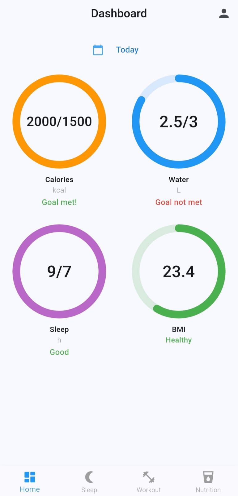

# FitJAMX Fitness Tracker

A powerful, open-source Flutter health & fitness tracker using Firebase. Plan workouts, log nutrition and water, track sleep, monitor BMI, and visualize your progress.

## Interface

<p align="center">
  
  
  
</p>


## Features

- **Daily Dashboard** – Summarizes your calories, water, sleep, and BMI at a glance

- **Workout Logging** – Plan, log, edit, and complete daily workouts

- **Nutrition & Water Tracking** – Record daily calories and water, visualize history

- **Sleep Tracking** – Log sleep hours, view your sleep history

- **Interactive Charts** – See your last 7 days’ progress for all metrics

- **Personalized Goals** – Set custom targets for calories, water, and sleep

- **Profile Management** – Edit your personal data and targets anytime

- **Firebase Auth & Cloud Firestore** – Secure, real-time cloud data sync

## Deployment

**1. Clone the repository**

```bash
  git clone https://github.com/YOUR_USERNAME/fitnestx-fitness-tracker.git
```
**2. Install dependencies**

```bash
  flutter pub get
```
**3.  Create a Firebase Project with Authentication (Email/Password) and Cloud Firestore database enabled**


**4. Run the app**

```bash
  flutter run


```


